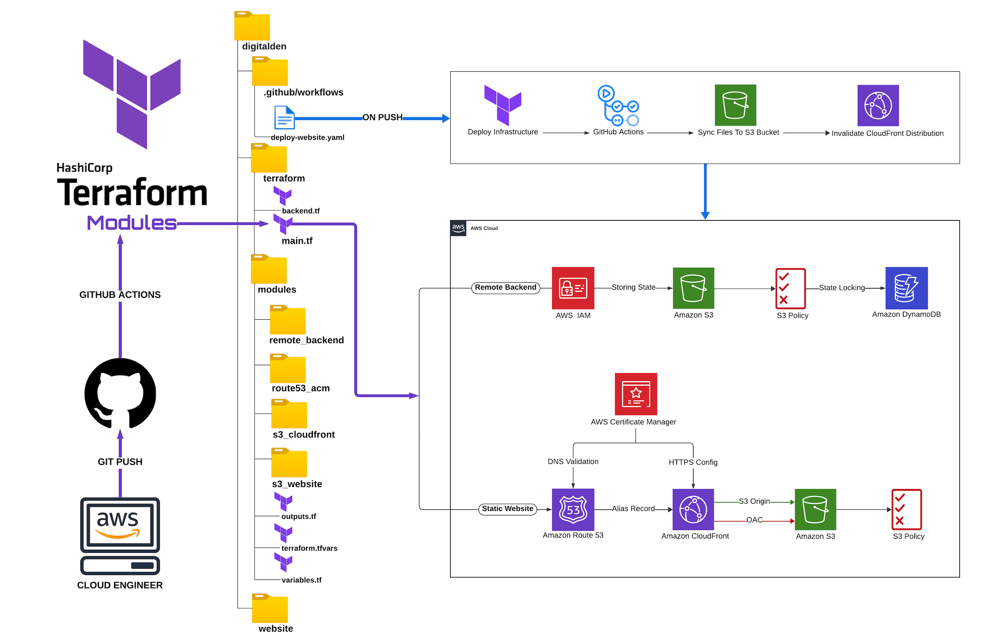
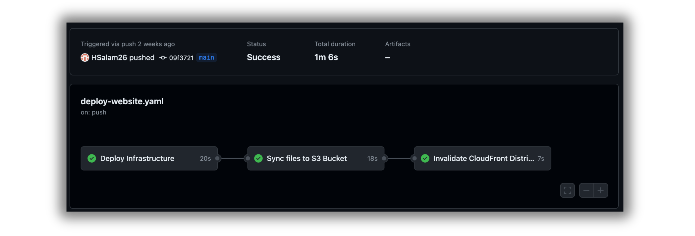

<h1 align="center">Static Web Hosting on AWS Series: Terraform Modules & GitHub Actions</h1>

## Tech Stack

- Terraform
- GitHub Actions
- AWS (IAM, S3, DynamoDB, ACM, Route 53, CloudFront)

## Overview

Welcome to my comprehensive series on automating infrastructure deployment and website hosting using Terraform, GitHub Actions, and AWS services. This repository documents the creation of a secure, scalable, and efficient web hosting environment through a series of carefully crafted Terraform modules and automated workflows.

## Project Steps Overview

1. **Initialize GitHub Repository and Local Setup:**

   - Set up a development environment with Visual Studio Code after cloning the GitHub repository to my local workstation.

2. **Terraform Remote Backend Setup:**

   - Configured a remote backend on AWS using a custom Terraform module, involving resources like an IAM user, S3 bucket, and DynamoDB table.

3. **CI/CD Pipeline with GitHub Actions:**

   - Automated infrastructure deployment through a GitHub Actions pipeline, triggered by git push events.

4. **DNS and SSL Certificate Management Module:**

   - Managed DNS with AWS Route 53 and automated SSL certificate provisioning with AWS Certificate Manager.

5. **AWS S3 Static Website Hosting Module:**

   - Set up an AWS S3 bucket to serve a static website, managing the bucket creation, versioning, and public access configurations.

6. **CI/CD Pipeline Enhancement for S3 Sync:**

   - Updated the CI/CD pipeline to include a job for synchronizing website files to the S3 bucket.

7. **AWS CloudFront Distribution Module for S3:**

   - Created a CloudFront distribution for the S3 bucket to deliver content globally, with optimized distribution settings.

8. **CI/CD Pipeline Enhancement for CloudFront Cache Invalidation:**

   - Enhanced the pipeline to invalidate the CloudFront cache whenever the S3 bucket is synchronized.

9. **Live Website Update:**
   - Commits to the repository trigger the automated pipeline, syncing changes to the S3 bucket and invalidating the CloudFront cache, reflecting updates on the live website.

## AWS Well-Architected Framework Alignment

This project aligns with the AWS Well-Architected Framework, ensuring best practices across the following pillars:

- **Operational Excellence:** CI/CD pipelines facilitate automated deployments and iterative improvements.
- **Security:** AWS IAM, Certificate Manager, and S3 bucket policies provide secure access management and data encryption.
- **Reliability:** AWS S3, DynamoDB, and Route 53 enhance system availability and fault tolerance.
- **Performance Efficiency:** AWS CloudFront ensures efficient content delivery with low latency.
- **Cost Optimization:** Precise resource provisioning through Terraform minimizes costs.
- **Sustainability:** Automation and efficient AWS services reduce the environmental impact.

## Key Highlights

- Terraform is employed for the entire infrastructure deployment and management.
- An automated CI/CD pipeline enables consistent updates and minimizes manual intervention.
- The project exemplifies the power of DevOps practices for cloud environments.

## Conclusion

This repository serves as a reference for those seeking to automate their AWS infrastructure and web hosting solutions. The modular approach taken illustrates the power of infrastructure as code and the benefits of automation in web hosting environments.
